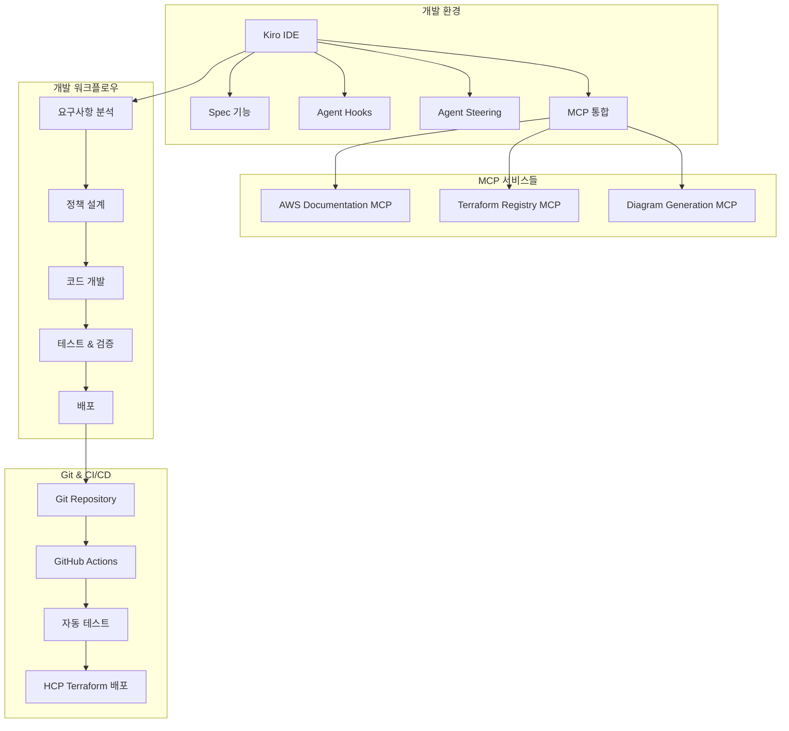
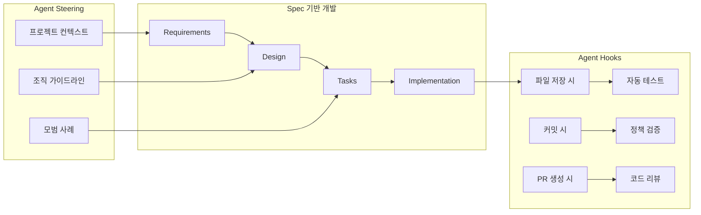

# Kiro와 Amazon Q를 활용한 Sentinel 개발 가이드 설계

## 개요

본 설계는 HCP Terraform 및 Terraform Enterprise 사용자들이 Kiro IDE의 고급 기능들과 MCP를 활용하여 효율적으로 Sentinel 정책을 개발할 수 있도록 하는 종합 가이드를 제공합니다. 이 가이드는 초보자부터 전문가까지 모든 수준의 개발자가 활용할 수 있는 체계적인 개발 방법론을 제시합니다.

## 아키텍처

### 전체 시스템 아키텍처



### Kiro IDE 기능 활용 구조



## 컴포넌트 및 인터페이스

### 1. 가이드 문서 구조

#### 1.1 기초 학습 모듈
- **Sentinel 문법 가이드**: 기본 문법, 데이터 타입, 함수 사용법
- **Terraform 데이터 접근**: tfplan, tfconfig, tfstate 활용법
- **정책 구조 이해**: imports, constants, functions, rules 구성

#### 1.2 Kiro IDE 활용 모듈
- **Spec 기반 개발**: 체계적인 정책 개발 프로세스
- **Agent Hooks 설정**: 자동화된 개발 워크플로우
- **Agent Steering 구성**: 프로젝트별 컨텍스트 관리

#### 1.3 MCP 통합 모듈
- **AWS Documentation MCP**: 최신 AWS 보안 가이드라인 참조
- **Terraform Registry MCP**: 모듈 정보 자동 수집
- **Diagram Generation MCP**: 정책 적용 범위 시각화

### 2. 개발 템플릿 라이브러리

#### 2.1 정책 템플릿 구조
```
templates/
├── security/
│   ├── cis-benchmark/
│   ├── soc2-compliance/
│   └── pci-dss/
├── cost-optimization/
│   ├── resource-sizing/
│   ├── unused-resources/
│   └── tagging-policies/
├── operational/
│   ├── backup-policies/
│   ├── monitoring/
│   └── logging/
└── custom/
    ├── organization-specific/
    └── industry-specific/
```

#### 2.2 템플릿 메타데이터
```yaml
# template-metadata.yaml
name: "EC2 Instance Security Policy"
category: "security"
subcategory: "cis-benchmark"
description: "CIS 벤치마크를 준수하는 EC2 인스턴스 보안 정책"
parameters:
  - name: "allowed_instance_types"
    type: "list"
    description: "허용되는 인스턴스 타입 목록"
  - name: "require_encryption"
    type: "boolean"
    description: "암호화 필수 여부"
dependencies:
  - "tfplan-functions"
  - "tfresources"
tags:
  - "ec2"
  - "security"
  - "cis"
```

### 3. Kiro Spec 구조

#### 3.1 Spec 템플릿
```markdown
# Sentinel 정책 개발 Spec

## Requirements
- 비즈니스 요구사항 정의
- 컴플라이언스 기준 명시
- 기술적 제약사항 식별

## Design
- 정책 아키텍처 설계
- 데이터 플로우 정의
- 예외 처리 방안

## Tasks
- 개발 작업 분해
- 테스트 계획 수립
- 배포 전략 정의
```

### 4. Agent Hooks 구성

#### 4.1 개발 단계별 Hooks
```yaml
# .kiro/hooks/sentinel-development.yaml
hooks:
  - name: "auto-test-on-save"
    trigger: "file_save"
    pattern: "*.sentinel"
    action: "run_sentinel_test"
    
  - name: "validate-on-commit"
    trigger: "git_commit"
    pattern: "policies/**/*.sentinel"
    action: "validate_policy_syntax"
    
  - name: "review-on-pr"
    trigger: "pull_request"
    action: "generate_policy_review"
```

#### 4.2 Hook 액션 정의
```python
# hooks/actions/sentinel_actions.py
def run_sentinel_test(file_path):
    """파일 저장 시 자동 테스트 실행"""
    return execute_command(f"sentinel test {file_path}")

def validate_policy_syntax(files):
    """커밋 시 정책 문법 검증"""
    for file in files:
        result = execute_command(f"sentinel fmt -check {file}")
        if result.returncode != 0:
            return {"status": "error", "message": f"Syntax error in {file}"}
    return {"status": "success"}

def generate_policy_review(pr_files):
    """PR 시 자동 코드 리뷰 생성"""
    review_points = []
    for file in pr_files:
        # 정책 분석 및 리뷰 포인트 생성
        review_points.extend(analyze_policy(file))
    return {"review_points": review_points}
```

### 5. Agent Steering 설정

#### 5.1 프로젝트별 Steering 파일
```markdown
# .kiro/steering/sentinel-context.md
---
inclusion: always
---

# Sentinel 개발 컨텍스트

## 조직 표준
- 모든 정책은 CIS 벤치마크를 기준으로 합니다
- 정책명은 kebab-case를 사용합니다
- 모든 정책에는 한글 메시지를 포함해야 합니다

## 코딩 스타일
- 상수는 대문자와 언더스코어를 사용합니다
- 함수명은 snake_case를 사용합니다
- 주석은 한글로 작성합니다

## 필수 포함 요소
- 정책 설명 주석
- 매개변수 문서화
- 예외 처리 로직
- 테스트 케이스

#[[file:templates/policy-template.sentinel]]
```

#### 5.2 조건부 Steering 파일
```markdown
# .kiro/steering/aws-specific.md
---
inclusion: fileMatch
fileMatchPattern: 'policies/aws/**'
---

# AWS 특화 가이드라인

## AWS 서비스별 정책 패턴
- EC2: 인스턴스 타입, 보안 그룹, 키 페어 검증
- S3: 버킷 정책, 암호화, 퍼블릭 액세스 차단
- IAM: 최소 권한 원칙, 정책 복잡도 제한

#[[file:aws-service-patterns.md]]
```

## 데이터 모델

### 1. 정책 메타데이터 모델
```typescript
interface PolicyMetadata {
  name: string;
  version: string;
  category: PolicyCategory;
  description: string;
  author: string;
  created: Date;
  updated: Date;
  parameters: Parameter[];
  dependencies: string[];
  tags: string[];
  compliance: ComplianceStandard[];
}

interface Parameter {
  name: string;
  type: 'string' | 'number' | 'boolean' | 'list' | 'map';
  description: string;
  default?: any;
  required: boolean;
  validation?: ValidationRule;
}

interface ComplianceStandard {
  framework: 'CIS' | 'SOC2' | 'PCI-DSS' | 'NIST';
  control: string;
  description: string;
}
```

### 2. 테스트 케이스 모델
```typescript
interface TestCase {
  name: string;
  description: string;
  mock_data: MockData;
  expected_result: boolean;
  expected_violations: Violation[];
}

interface MockData {
  tfplan?: any;
  tfconfig?: any;
  tfstate?: any;
  parameters?: Record<string, any>;
}

interface Violation {
  resource_address: string;
  message: string;
  severity: 'low' | 'medium' | 'high' | 'critical';
}
```

### 3. 개발 워크플로우 모델
```typescript
interface DevelopmentWorkflow {
  stages: WorkflowStage[];
  hooks: Hook[];
  approvals: ApprovalRule[];
}

interface WorkflowStage {
  name: string;
  actions: Action[];
  conditions: Condition[];
  next_stage?: string;
}

interface Hook {
  trigger: 'file_save' | 'git_commit' | 'pull_request';
  pattern: string;
  action: string;
  enabled: boolean;
}
```

## 오류 처리

### 1. 정책 개발 단계별 오류 처리

#### 1.1 문법 오류
```sentinel
# 문법 검증 함수
validate_syntax = func(policy_content) {
    # Sentinel 파서를 사용한 문법 검증
    result = parse_sentinel(policy_content)
    if result.errors {
        return {
            "valid": false,
            "errors": result.errors,
            "suggestions": generate_syntax_suggestions(result.errors)
        }
    }
    return {"valid": true}
}
```

#### 1.2 로직 오류
```sentinel
# 로직 검증 함수
validate_logic = func(policy, test_cases) {
    errors = []
    for test_cases as _, test_case {
        result = execute_policy(policy, test_case.mock_data)
        if result != test_case.expected_result {
            append(errors, {
                "test_case": test_case.name,
                "expected": test_case.expected_result,
                "actual": result,
                "suggestion": "테스트 케이스와 정책 로직을 재검토하세요"
            })
        }
    }
    return errors
}
```

#### 1.3 성능 오류
```sentinel
# 성능 모니터링 함수
monitor_performance = func(policy, large_dataset) {
    start_time = time.now()
    result = execute_policy(policy, large_dataset)
    execution_time = time.now() - start_time
    
    if execution_time > 30 {  # 30초 초과 시 경고
        return {
            "warning": true,
            "execution_time": execution_time,
            "suggestion": "정책 로직을 최적화하거나 데이터 필터링을 개선하세요"
        }
    }
    return {"warning": false, "execution_time": execution_time}
}
```

### 2. MCP 통합 오류 처리

#### 2.1 MCP 연결 오류
```python
# MCP 연결 상태 확인
def check_mcp_connection(mcp_server):
    try:
        response = mcp_server.ping()
        return {"status": "connected", "latency": response.latency}
    except ConnectionError as e:
        return {
            "status": "disconnected",
            "error": str(e),
            "suggestion": "MCP 서버 설정을 확인하고 재연결을 시도하세요"
        }
```

#### 2.2 데이터 수집 오류
```python
# AWS 문서 수집 오류 처리
def fetch_aws_documentation(topic, fallback_enabled=True):
    try:
        docs = aws_docs_mcp.search(topic)
        return {"success": True, "data": docs}
    except Exception as e:
        if fallback_enabled:
            # 로컬 캐시된 문서 사용
            cached_docs = load_cached_docs(topic)
            return {
                "success": True,
                "data": cached_docs,
                "warning": "MCP 서버 오류로 캐시된 데이터를 사용합니다"
            }
        return {"success": False, "error": str(e)}
```

## 테스팅 전략

### 1. 단위 테스트
```sentinel
# 단위 테스트 예제
test "ec2_instance_type_validation" {
    # Given
    mock_tfplan = {
        "planned_values": {
            "resources": [
                {
                    "address": "aws_instance.example",
                    "values": {
                        "instance_type": "t3.micro"
                    }
                }
            ]
        }
    }
    
    # When
    result = validate_instance_type(mock_tfplan, ["t3.micro", "t3.small"])
    
    # Then
    assert result.violations is empty
}
```

### 2. 통합 테스트
```yaml
# 통합 테스트 시나리오
integration_tests:
  - name: "complete_ec2_policy_validation"
    description: "EC2 인스턴스 생성 시 모든 보안 정책 검증"
    terraform_config: "test/fixtures/ec2-complete.tf"
    expected_violations: 0
    
  - name: "policy_violation_detection"
    description: "정책 위반 사항 정확한 탐지"
    terraform_config: "test/fixtures/ec2-violations.tf"
    expected_violations: 3
    expected_messages:
      - "인스턴스 타입이 허용되지 않습니다"
      - "보안 그룹이 0.0.0.0/0을 허용합니다"
      - "EBS 볼륨이 암호화되지 않았습니다"
```

### 3. 성능 테스트
```python
# 성능 테스트 스크립트
def performance_test_policy(policy_path, scale_factor=1000):
    """대규모 Terraform 상태에서 정책 성능 테스트"""
    
    # 대규모 모의 데이터 생성
    large_tfplan = generate_large_tfplan(scale_factor)
    
    # 성능 측정
    start_time = time.time()
    result = execute_sentinel_policy(policy_path, large_tfplan)
    execution_time = time.time() - start_time
    
    # 메모리 사용량 측정
    memory_usage = get_memory_usage()
    
    return {
        "execution_time": execution_time,
        "memory_usage": memory_usage,
        "violations_found": len(result.violations),
        "performance_grade": calculate_performance_grade(execution_time, memory_usage)
    }
```

이 설계는 Kiro IDE의 고급 기능들을 최대한 활용하여 Sentinel 정책 개발의 전체 라이프사이클을 체계적으로 지원하는 종합적인 가이드를 제공합니다.