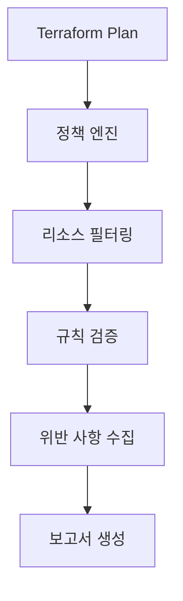

# {{POLICY_NAME}} Sentinel 정책 개발 Spec

## Requirements

### 비즈니스 요구사항
- **목적**: {{BUSINESS_PURPOSE}}
- **대상 리소스**: {{TARGET_RESOURCES}}
- **컴플라이언스 기준**: {{COMPLIANCE_STANDARDS}}

### 기술적 요구사항
- **Terraform 버전**: {{TERRAFORM_VERSION}}
- **AWS Provider 버전**: {{AWS_PROVIDER_VERSION}}
- **지원 리전**: {{SUPPORTED_REGIONS}}

### 정책 요구사항

#### 요구사항 1: {{REQUIREMENT_1_TITLE}}
**사용자 스토리**: {{REQUIREMENT_1_USER_STORY}}

##### 승인 기준
1. WHEN {{CONDITION_1}} THEN {{EXPECTED_BEHAVIOR_1}}
2. WHEN {{CONDITION_2}} THEN {{EXPECTED_BEHAVIOR_2}}
3. IF {{PRECONDITION_1}} THEN {{EXPECTED_RESPONSE_1}}

#### 요구사항 2: {{REQUIREMENT_2_TITLE}}
**사용자 스토리**: {{REQUIREMENT_2_USER_STORY}}

##### 승인 기준
1. WHEN {{CONDITION_3}} THEN {{EXPECTED_BEHAVIOR_3}}
2. WHEN {{CONDITION_4}} THEN {{EXPECTED_BEHAVIOR_4}}

## Design

### 정책 아키텍처

### 데이터 플로우
1. **입력 데이터**: {{INPUT_DATA_DESCRIPTION}}
2. **처리 과정**: {{PROCESSING_DESCRIPTION}}
3. **출력 결과**: {{OUTPUT_DESCRIPTION}}

### 예외 처리
- **예외 상황 1**: {{EXCEPTION_1_DESCRIPTION}}
- **처리 방법**: {{EXCEPTION_1_HANDLING}}

### 성능 고려사항
- **예상 실행 시간**: {{EXPECTED_EXECUTION_TIME}}
- **메모리 사용량**: {{EXPECTED_MEMORY_USAGE}}
- **최적화 방안**: {{OPTIMIZATION_STRATEGIES}}

## Tasks

- [ ] 1. 기본 정책 구조 구현
  - 필요한 imports 및 constants 정의
  - 기본 함수 및 변수 구조 설정
  - _요구사항: {{RELATED_REQUIREMENTS}}_

- [ ] 2. 리소스 필터링 로직 구현
  - 대상 리소스 식별 및 추출
  - 조건부 필터링 로직 구현
  - _요구사항: {{RELATED_REQUIREMENTS}}_

- [ ] 3. 검증 규칙 구현
  - 핵심 비즈니스 로직 구현
  - 예외 상황 처리 로직 추가
  - _요구사항: {{RELATED_REQUIREMENTS}}_

- [ ] 4. 테스트 케이스 작성
  - 단위 테스트 케이스 작성
  - 통합 테스트 시나리오 구성
  - _요구사항: {{RELATED_REQUIREMENTS}}_

- [ ] 5. 문서화 및 최종 검토
  - 정책 사용법 문서 작성
  - 코드 리뷰 및 최적화
  - _요구사항: {{RELATED_REQUIREMENTS}}_